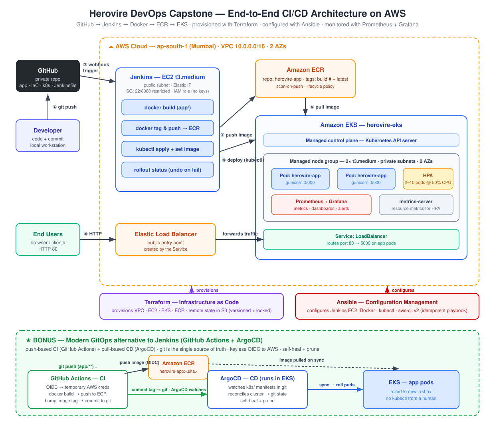

<!--
To present: open in VS Code with the Marp extension, or run
  marp docs/PRESENTATION.md --pdf
Slides are separated by ---
-->

# End-to-End DevOps CI/CD Pipeline on AWS

Herovire Capstone, Batch 15
Rohit Gupta

---

## What I built

A pipeline that takes my app from a `git push` to a running, monitored
service on AWS, without any manual steps.

What it had to do:

- Containerize the app and build it automatically
- Create all AWS infrastructure from code, not the console
- Deploy to a Kubernetes cluster
- Monitor it and alert when something breaks
- Stay cheap and tear down cleanly

<!--
Opener: I built a pipeline that goes from source code to a monitored app on
EKS, and I ran the whole thing end to end.
-->

---

## Architecture

```
Developer
   |  git push
   v
GitHub --> Jenkins (EC2) --> Docker build --> Amazon ECR
                                                 |
Terraform (VPC, EKS, IAM, ECR)  <-- provisions --|
Ansible (configures Jenkins host)                |
                                                 v
                             kubectl / rollout --> Amazon EKS
                                                 |
                       Prometheus + Grafana <-- scrapes /metrics
```

<!--
Code flows left to right into ECR and then onto EKS. Terraform builds the
platform underneath. Ansible sets up the Jenkins box. Prometheus watches it.
Region is ap-south-1.
-->

---

<!-- _paginate: false -->


<!--
Full diagram. Walk it top to bottom.
-->

---

## Tools I used

| Stage | Tool | What it does |
|---|---|---|
| Build | Docker + Jenkins | Build the image, push to ECR |
| Infrastructure | Terraform | VPC, EKS, ECR, IAM, state in S3 |
| Configuration | Ansible | Sets up the Jenkins server |
| Deploy | kubectl and EKS | Rolls the image onto the cluster |
| Monitoring | Prometheus + Grafana | Metrics, dashboard, alerts |

The app itself is a small Flask service with `/`, `/health` and `/metrics`.

---

## Build and deploy (Jenkins)

The `Jenkinsfile` pipeline runs:

`Checkout -> Build -> ECR login -> Tag and Push -> Deploy -> Smoke Test`

- Images go to ECR, tagged with the build number
- Deploy runs `kubectl apply` then updates the image tag
- `kubectl rollout status` gates the build, so it only passes if pods come up healthy
- If the smoke test fails, the pipeline rolls back with `kubectl rollout undo`

<!--
The rollout-status gate is the important bit. Without it the pipeline would
report success even if the pods never started.
-->

---

## Infrastructure as code (Terraform)

Everything on AWS is defined in `terraform/`:

- VPC with public and private subnets, plus NAT
- EKS cluster `herovire-eks`, 2 t3.medium nodes in private subnets
- ECR repository with a lifecycle policy
- IAM roles, security groups, OIDC provider

State lives in a versioned S3 bucket, so the environment is reproducible.
`terraform plan` costs nothing, so I only ran `apply` when I was actually working.

---

## Configuration (Ansible)

Ansible sets up the Jenkins EC2 host: Jenkins, Docker, kubectl and the AWS CLI.

It is idempotent, so re-running it just converges to the same state.

**Why both Terraform and Ansible?**
Terraform creates the machine. Ansible installs and configures what runs on it.

<!--
This comes up in vivas. Terraform = provisioning, Ansible = configuration.
They do different jobs.
-->

---

## Kubernetes

- Deployment with 2 replicas
- Service of type LoadBalancer, so the app is reachable publicly
- HPA to scale on CPU (needs metrics-server installed)
- Liveness and readiness probes on `/health`

<!--
Show `kubectl get pods` at 2/2 Running and the LB URL returning 200.
-->

---

## Monitoring

- Installed kube-prometheus-stack with Helm (Prometheus, Grafana, Alertmanager)
- The app uses `prometheus-flask-exporter` to expose `/metrics`
- A ServiceMonitor tells Prometheus to scrape it
- Grafana dashboard shows request rate: `rate(flask_http_request_total[1m])`
- Alert `AppPodDown` fires when the scrape target stops responding

<!--
Honest caveat if asked: the alert fires when a live target fails a scrape, not
when pods scale to zero (the target just disappears). An absent() rule would
handle that better.
-->

---

## Testing

- `tests/smoke_test.sh` checks that `/` and `/health` return 200
- `tests/infra_test.sh` checks nodes are Ready, pods Running, LB is up
- The smoke test runs as a Jenkins stage, so a bad deploy fails the build
- I ran the full cycle end to end: apply, test, destroy

---

## Bonus: GitOps with GitHub Actions and ArgoCD

I also built a second, more modern path and ran it live:

- GitHub Actions builds and pushes the image, authenticating with OIDC
  so no AWS keys are stored in GitHub
- It then updates the image tag in `k8s/deployment.yaml` and commits it
- ArgoCD watches the repo and syncs the cluster to match

One push took the app from v1 to v2 with no `kubectl` from me.

<!--
Difference from Jenkins: Jenkins pushes changes to the cluster, ArgoCD pulls
from git. Git becomes the source of truth.
-->

---

## Demo

1. App running as v1 on its LoadBalancer URL
2. Push a small change
3. GitHub Actions goes green
4. ArgoCD flips from OutOfSync to Synced, pods roll
5. Refresh, app is now v2
6. `kubectl scale --replicas=1`, ArgoCD puts it back to 2

<!--
Screenshots as backup if the live demo fails.
Deleting a pod is Kubernetes healing it. Reverting my scale is ArgoCD healing
drift from git. Two different layers.
-->

---

## Problems I ran into

- My Mac builds arm64 images but the nodes are amd64, so pods failed to pull.
  Fixed by building with `--platform linux/amd64`
- Leftover LoadBalancers blocked the VPC from deleting. I now delete the
  Services before running destroy
- Prometheus was scraping nothing because the Service was missing an `app` label
- The ArgoCD CRD was too big for a normal apply, needed `--server-side`
- ArgoCD kept recreating things during teardown until I deleted the App first

<!--
Good story: ArgoCD deployed exactly what git said, which is how I found out my
remote branch was behind and pointing at an old account. The tool caught a
mistake I had missed.
-->

---

## Cost

- Running cost is roughly $0.25 to $0.30 per hour (EKS, 2 nodes, NAT, LB)
- Writing code and running `plan` is free, only `apply` costs anything
- Kept it small: 2 t3.medium nodes, 3 day metrics retention, one NAT gateway
- Destroyed everything after each session, so a full build and test cycle
  cost about $0.25
- ECR lifecycle policy clears out untagged images

---

## What I learned

- Infrastructure as code makes environments reproducible and disposable
- Terraform and Ansible solve different problems
- Push based delivery (Jenkins) and pull based delivery (ArgoCD) are both valid
- OIDC and short lived credentials are better than storing secrets
- A deploy is not finished until you can see that it is healthy
- Cost control has to be a habit, not something you fix at the end

---

## Summary

GitHub to Jenkins to Docker to ECR to Terraform to Ansible to EKS,
with Prometheus and Grafana on top, plus a working GitOps path.

One `git push` gets me a running, monitored app on Kubernetes.

## Thank you. Questions?
